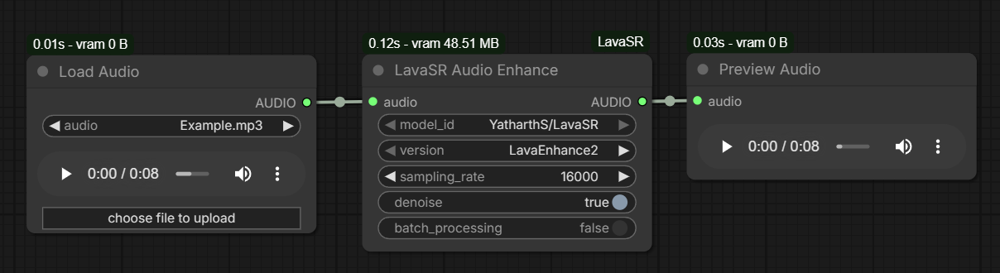

# 🌋 ComfyUI LavaSR

[](https://github.com/comfyanonymous/ComfyUI)
[](https://github.com/NightMean/ComfyUI-LavaSR)
[](LICENSE)

A custom node for [ComfyUI](https://github.com/comfyanonymous/ComfyUI) that integrates the lightweight [LavaSR](https://github.com/ysharma3501/LavaSR) speech enhancement model. LavaSR enhances low-quality audio with speeds reaching roughly 5000x realtime on GPU and over 60x realtime on CPU.



## Features
- **Extremely Fast**: Achieves enhancement speeds of up to 5000x real-time on modern GPUs and 50x real-time on CPUs.
- **High-Quality Speech Enhancement**: Converts low-quality or noisy input audio into crisp, studio-quality 48kHz audio.
- **High Efficiency**: Extremely lightweight, requiring just **~500MB VRAM** to run.
- **Local Model Support**: Automatically detects and loads models placed in `ComfyUI/models/lavasr/`. Falls back to automatically downloading the default model (`YatharthS/LavaSR`) from Hugging Face if none are found locally.
- **Denoising & Batching**: Provides dedicated toggles for heavy background denoising and batch processing (crucial for preventing OOM on very long audio files).

> 💡 **Tip:** This node pairs exceptionally well with [ComfyUI-KittenTTS](https://github.com/NightMean/ComfyUI-KittenTTS) for fast, low-VRAM voice generation. You can pipe the output from KittenTTS directly into LavaSR for incredibly crisp results.

## Installation

### Method 1: ComfyUI Manager (Recommended)
You can install this node via the [ComfyUI Manager](https://github.com/ltdrdata/ComfyUI-Manager) by searching for "LavaSR" or by installing from this Git URL. The dependencies should install automatically.

### Method 2: Manual Installation

This extension requires the `LavaSR` python package to be installed in your ComfyUI python environment.

1. Navigate to your ComfyUI `custom_nodes` directory:
```bash
cd ComfyUI/custom_nodes
```
2. Clone this repository:
```bash
git clone https://github.com/NightMean/ComfyUI-LavaSR.git
```
3. Install the required `LavaSR` python package. 

**For standard Python environments:**
```bash
python -m pip install git+https://github.com/ysharma3501/LavaSR.git
```
**For ComfyUI Portable (Windows Standalone):**
Open a terminal in your main ComfyUI folder and run:
```powershell
.\python_embeded\python.exe -m pip install git+https://github.com/ysharma3501/LavaSR.git
```

### Model Setup
By default, the node will automatically download the required model from Hugging Face into `ComfyUI/models/lavasr/YatharthS_LavaSR` upon first use. 

### Method 3: Manual Model Download (Optional)
If you prefer to download the model manually, or if your environment blocks automatic Hugging Face downloads:

1. Download the files from [YatharthS/LavaSR on Hugging Face](https://huggingface.co/YatharthS/LavaSR/tree/main).
2. Place the downloaded files or folder into:
`ComfyUI/models/lavasr/YatharthS_LavaSR`
3. Restart ComfyUI and select your custom folder name from the **model_id** dropdown.

## Usage
You can find an example workflow in [`example_workflow/LavaSR_example_workflow.json`](example_workflow/LavaSR_example_workflow.json)

1. Connect a **Load Audio** node.
2. Connect it to the `audio` input of **LavaSR Enhance**.
3. Add a **Save Audio** node and connect the `audio` output from the LavaSR node to it.

### Node Parameters

- **model_id**: Select the HuggingFace ID `YatharthS/LavaSR` (loads automatically via internet) or select a locally cached directory name if you placed the models manually inside `ComfyUI/models/lavasr/`.
- **version**: Select `LavaEnhance2` (default, highest quality) or `LavaEnhance1`.
- **sampling_rate**: The assumed source quality of your input audio. Best practice is to match the source audio's sample rate (e.g., 8000Hz for old phones, 16000Hz for standard mic audio).
- **denoise**: Set to True to heavily denoise the background audio before running enhancement.
- **batch_processing**: Set to True to process highly sustained, long audio files (prevents Out-Of-Memory errors).

## Donations
To support me you can use link below:

<a href="https://www.buymeacoffee.com/nightmean" target="_blank"></a>

## Author & Credits
- [LavaSR](https://github.com/ysharma3501/LavaSR) by [@ysharma3501](https://github.com/ysharma3501)
- ComfyUI node by [@NightMean](https://github.com/NightMean)

## License
Apache 2.0 - See [LICENSE](LICENSE) for details.